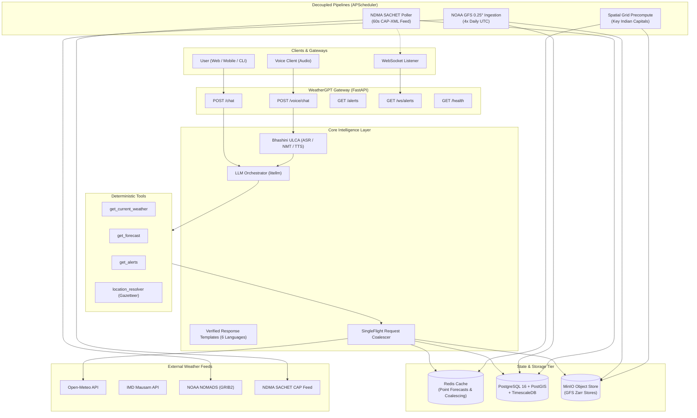

# WeatherGPT 🌦️

**Conversational AI for Weather Forecasting, Disaster Alerts, and Climate Intelligence targeting India.**

Built for real-time meteorological integration, multilingual accessibility across Indian languages, and sub-50ms deterministic forecasting.

---

## 🏛️ Core Design Principle

> **"The LLM never computes or recalls weather."**
>
> 1. Parses user intent into a structured function call.
> 2. Calls deterministic tools backed by NWP numerical models (NOAA GFS / ECMWF), IMD, and Open-Meteo.
> 3. Phrases structured JSON facts into natural language using verified templates for the factual core.
>
> **Every number comes from a deterministic service. This boundary is sacred.**

---

## 📐 Architecture Overview



---

## 🚀 Key Features

- **Sub-50ms Deterministic Forecasts:** NOAA GFS 0.25° NWP numerical weather grids decoded via `cfgrib`/`xarray`, spatial bounding box subsetting (6°-38°N, 68°-98°E), cached in chunked Zarr stores.
- **Multilingual Safe Generation:** Factual numbers are populated into verified templates across **6 Indic languages** (English, Hindi, Tamil, Telugu, Bengali, Marathi) in <1ms without LLM hallucinations.
- **Voice-to-Voice Pipeline:** Full speech-to-speech interaction via Bhashini ULCA APIs (ASR, NMT, TTS) with Groq Whisper and gTTS fallback across 23 scheduled Indian languages.
- **Proactive Disaster Alerts:** NDMA SACHET CAP-XML alert polling with PostGIS spatial polygon intersections (`ST_Intersects`) and WebSocket streaming.
- **High Concurrency & Cache-Stampede Protection:** `SingleFlight` request coalescing prevents upstream dogpiling; connection pools across `asyncpg` (20 conn), Redis (`ConnectionPool`), and `httpx.Limits` (100 conn).
- **Production Scalability:** Decoupled stateless FastAPI pods and background pipeline workers with Kubernetes Horizontal Pod Autoscaling (HPA) targeting 70% CPU / 80% memory.

---

## 🛠️ Quickstart

### Prerequisites
- Python 3.13+
- [Astral `uv`](https://docs.astral.sh/uv/) (blazing-fast Python package installer)
- Docker & Docker Compose (for containerized deployment)

---

### Option 1: Local Development with `uv`

```bash
# 1. Clone repository
git clone https://github.com/SoloBeing/WeatherGPT.git
cd WeatherGPT

# 2. Synchronize virtual environment with frozen dependencies
uv sync

# 3. Configure environment variables
cp .env.example .env

# 4. Run automated system demonstration
uv run python scripts/demo.py

# 5. Start development API server
uv run uvicorn app.main:app --reload --port 8000
```

---

### Option 2: Full-Stack Docker Compose

Run the entire stack (FastAPI, PostgreSQL + PostGIS + TimescaleDB, Redis, MinIO, auto-bucket initializer, and Alembic migrations) in one command:

```bash
# Launch all 7 services
docker compose up -d

# Check service health and logs
docker compose ps
docker compose logs -f api

# Access services:
# - API Gateway:        http://localhost:8000
# - Health Diagnostics: http://localhost:8000/health
# - MinIO Web Console:  http://localhost:9001 (User: minioadmin / Pass: minioadmin)
```

For hot-reload local development inside containers:
```bash
cp docker-compose.override.yml.example docker-compose.override.yml
docker compose up -d
```

---

### Option 3: Production Kubernetes Deployment

Deploy the entire WeatherGPT system to any Kubernetes cluster (Minikube, Kind, GKE, EKS):

```bash
# Deploy all 13 manifests using Kustomize
kubectl apply -k k8s/

# Verify rollout status
kubectl get pods -n weathergpt
kubectl get hpa -n weathergpt
kubectl get ingress -n weathergpt
```

---

## 🧪 Interactive System Demo

Run the built-in end-to-end demonstration runner to exercise all 8 subsystems with real-time timings:

```bash
uv run python scripts/demo.py
```

**Output Preview:**
```text
======================================================================
🌦️  WEATHERGPT — CONVERSATIONAL AI FOR METEOROLOGICAL INTELLIGENCE
======================================================================
[Step 01] Subsystem Health & Lifespan Verification
  ✔ Health check executed in 1.28ms
[Step 02] Geocoding & 36 Indian States/UTs Gazetteer
  • Bengaluru    -> Lat: 12.9716, Lon: 77.5946 | State: Bengaluru | Confidence: 1.0
  • Mumbai       -> Lat: 19.0760, Lon: 72.8777 | State: Mumbai    | Confidence: 1.0
  ✔ Resolved 5 locations across India in 1142.05ms
[Step 03] Deterministic Current Weather Query
  Target Location   : Bengaluru, Bengaluru, India
  Temperature       : 30.9 °C | Humidity: 58.9% | Wind: 20.0 km/h
  Data Provider     : NOAA GFS (0.25° NWP via Zarr - gfs_20260906_12z)
  ✔ Weather retrieved deterministically in 466.11ms (Cache & SingleFlight verified)
[Step 04] Multi-Day Forecast & Numerical Timeline
  ✔ Computed 3-day forecast with hourly granularity in 21.70ms
[Step 05] NDMA SACHET Disaster Alert Feed
  ✔ Spatial alert intersection evaluated in 84.00ms
[Step 06] Multilingual Templated Response Generation
  • HI : Mumbai में अभी: Partly cloudy, तापमान 29.5°C (महसूस 32.0°C)।
  • TA : Mumbai இல் தற்போது: Partly cloudy, வெப்பநிலை 29.5°C.
  ✔ Generated verified factual sentences across 6 languages in 1.25ms
[Step 07] Bhashini ULCA Voice & Translation Service
  ✔ Voice & NMT capabilities verified in 365.71ms
[Step 08] Multi-Turn Conversational LLM Loop (/chat)
  ✔ End-to-end tool-calling LLM loop finished in 4007.59ms
======================================================================
🚀  ALL 8 DEMONSTRATION STEPS SUCCEEDED IN 7368.3MS
======================================================================
```

---

## 📡 API Reference

| Method | Endpoint | Description |
|---|---|---|
| `POST` | `/chat` | Multi-turn conversational weather and alert chat with tool-calling |
| `POST` | `/voice/chat` | Multilingual voice-in / voice-out pipeline (ASR → NMT → LLM → TTS) |
| `GET` | `/voice/languages` | Returns all 23 supported ULCA Indic language codes |
| `GET` | `/ws/alerts` | Live WebSocket stream for real-time NDMA disaster notifications |
| `GET` | `/health` | Subsystem health diagnostics (Postgres, Redis, Ingestion Scheduler) |

---

## 🧪 Test Suite

Run the complete test suite under strict zero-warning enforcement (`-W error`):

```bash
uv run pytest
```

```text
============================= 42 passed in 13.19s ==============================
```

- **Pass rate:** 100% (42/42 tests passing)
- **Warning hygiene:** 0 warnings.
- **Coverage:** Resilience, singleflight coalescing, Zarr storage integrity, GFS failover, connection pooling, and Kubernetes deployment schemas.

---

## 📜 License

Apache-2.0 License. Built for the Weather AI Competition (2026).
